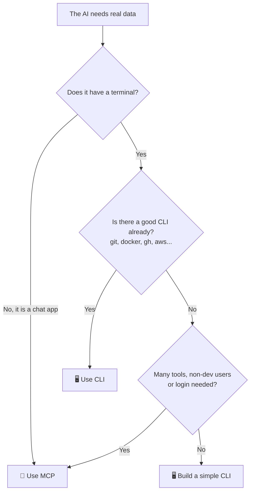

# 🍕 AI with CLI and MCP: why it gets more answers right

🇺🇸 English | 🇧🇷 [Português](README.pt-BR.md)

[](https://github.com/DenisHBernardino/ai-with-cli/actions/workflows/tests.yml)

A simple experiment to show one idea:

> **An AI without access to data makes things up. With a CLI or an MCP to check, it gets it right.**

Here, the AI works at **Nona Byte Pizza**, a fake pizza shop.
It has no way to "know" the menu.
So we ask the same questions in 3 scenarios:

- **No tools:** the AI only has its own memory.
- **With CLI:** the AI runs the `pizza` command in a terminal.
- **With MCP:** the AI gets ready-made "buttons" from an MCP server.

Then we compare correct answers and cost.


**Fastest way to see it:** run `python app.py` and open **The Arena** in your browser. 🏟️

---

## 🧠 CLI or MCP? Think of a pizza shop


**CLI = ordering at the counter.**
You say it directly: "one large Margherita".
It is fast and cheap. But you need to be there and know how to order.

**MCP = a delivery app.**
It has buttons, login and payment. Anyone can use it, from anywhere.
But the app loads the full menu every time it opens.

For the AI, this "menu" is the tool descriptions.
They are sent with **every** question, and they cost tokens.

---

## 🧭 Which one should I use?



| Situation | Best choice |
|---|---|
| Coding agent in your project | 🖥️ CLI |
| Tool that already has a CLI (git, docker, gh, aws) | 🖥️ CLI |
| You want to spend few tokens | 🖥️ CLI |
| Chat app, no terminal | 🔌 MCP |
| Many tools or APIs | 🔌 MCP |
| Team with people who don't code | 🔌 MCP |
| You need login, permissions and audit logs | 🔌 MCP |

**It's not a war.** Many projects use both.

---

## 📁 Project structure

| File | What it does |
|---|---|
| `pizza.py` | The CLI. Reads the menu and answers commands. |
| `mcp_server.py` | The MCP server. Same data, delivered as tools. |
| `core.py` | Shared logic: talks to the AI, runs tools, counts tokens. |
| `app.py` + `web/index.html` | 🏟️ The Arena: the web page. |
| `experiment.py` | The terminal version: all questions, many runs, a score table. |
| `.env.example` | Template for your `.env` file with the API key. |
| `data.json` | The menu (our "database"). |
| `questions.json` | The test questions and the right answers. |
| `runs/demo.json` | A recorded real run, for replay mode (you create it). |
| `tests/` | Automated tests (run on GitHub Actions). |
| `docs/cli-vs-mcp.svg` | The infographic above. |

---

## 🚀 Step by step

### 1. Clone and install

```bash
git clone https://github.com/DenisHBernardino/ai-with-cli.git
cd ai-with-cli
python -m venv .venv
source .venv/bin/activate        # Windows: .venv\Scripts\activate
pip install -r requirements.txt
```

You need Python 3.10 or newer.

### 2. Play with the CLI yourself

Before the AI, try it yourself. This is what the AI will use.

```bash
python pizza.py --help
python pizza.py menu
python pizza.py menu --vegetarian
python pizza.py search mushroom
python pizza.py price four cheese --size L
python pizza.py price pepperoni --json
```

### 3. Add your API key

Get a key at [console.anthropic.com](https://console.anthropic.com) (Settings > API keys).

Copy the example file and paste your key into it:

```bash
cp .env.example .env          # Windows: copy .env.example .env
```

```
ANTHROPIC_API_KEY=sk-ant-your-key-here
```

The `.env` file is in `.gitignore`, so it **never** goes to GitHub.
No key? Skip this step: the tests and the CLI work without it.

### 4. Open the Arena 🏟️

```bash
python app.py
```

Your browser opens at `http://localhost:8000`.

- Click a question. The 3 AIs answer side by side.
- Watch the CLI column: the AI runs `pizza --help` **by itself** to learn the tool.
- Watch the "No tools" column: it answers with confidence, but it has no data.
- Drag the **hidden cost** slider from 3 to 50 MCP tools. The token bar grows. These are real counts from the API.

### 5. No API key? Use replay mode

Someone with a key records one real run:

```bash
python app.py --record      # saves runs/demo.json
```

Commit `runs/demo.json`. Now anyone can run `python app.py` **without a key**.
The page shows a "Replay of a real run" badge, so nobody thinks it is live.

### 6. Run the full experiment in the terminal

```bash
python experiment.py              # each question 3 times
python experiment.py --runs 1     # faster and cheaper
```

AI answers change from run to run, so the score is an average.

```
❓ 1. How much is a large Margherita?
     🔧 AI ran: pizza --help
     🔧 AI ran: pizza price margherita --size L
  ❌❌❌ [no tools] I don't have access to the current menu...
  ✅✅✅ [with CLI] A large Margherita costs $52.00.
     🔌 AI called: get_price({"pizza": "Margherita", "size": "L"})
  ✅✅✅ [with MCP] A large Margherita costs $52.00.
```

*(Example only. Your results will be different.)*

At the end, you get the score. Paste yours here. 👇

| Mode | Correct | Tokens per run | Tool calls per run | Fixed cost per call |
|---|---|---|---|---|
| no tools | ? / 6 | ? | 0 | 0 tokens |
| with CLI | ? / 6 | ? | ? | ? tokens |
| with MCP | ? / 6 | ? | ? | ? tokens |

**Fixed cost** = tokens the tool descriptions add to **every** call.

### 7. Run the tests

```bash
python -m unittest discover -s tests -t . -v
```

No API key needed. GitHub Actions runs them on every push.

---

## 🔍 What to look for in the results

**1. With no tools, the AI can't get it right.**
The menu is fake. The AI either guesses or says "I don't know". A good model usually refuses to guess, which is honest, but it still can't help.

**2. CLI and MCP learn the tool in different ways.**
The CLI AI often reads `--help` first, like a developer reading the docs.
The MCP AI skips that step, because MCP tools arrive already described. It goes straight to calling them.

**3. Output size drives the cost.**
In our tests, MCP spent more tokens than the CLI, even with only 3 tools.
The reason: the CLI answers with short text, and the MCP tools answer with full JSON.

Example from one real run (`claude-sonnet-5-5`):

| Question | CLI | MCP |
|---|---|---|
| "How much is a medium Ham & Egg plus a large Four Cheese?" | 1,352 tokens, 2 calls | 2,063 tokens, 2 calls |
| "Explore the tool, then tell me 3 ways you can help." | 3,444 tokens, 5 calls | 4,847 tokens, 4 calls |

In the second question, the CLI AI ran `pizza --help`, then `--help` for each command, then `pizza menu`.
The MCP AI called `list_menu` 3 times and got back 112, 64 and 97 lines of JSON.

*AI answers change on every run. Run your own and compare.*

**4. More tools = a bigger hidden cost.**
Drag the slider in the Arena from 3 to 50 tools. MCP sends all tool descriptions with every question.

---

## 💬 Questions to try

Type these in the Arena. They need several steps, so you see the AI really explore the tool.

| Question | What it shows | Expected answer |
|---|---|---|
| Before answering, explore what the pizza tool can do. Then tell me 3 ways you can help me. | How each AI learns the tool | Free answer |
| I want a Pepperoni. If I can't have it, what's the closest pizza available today? | Finds that Pepperoni is sold out, compares ingredients | Ham & Egg |
| I'm vegetarian and I have $40. What medium pizza can I order today? | Filter + price + availability | Banana Cinnamon ($38) |
| I'm allergic to onion. Which pizzas can I eat, and which is the cheapest large one? | Excludes ingredients | Banana Cinnamon ($48) |
| Which ingredient appears in the most pizzas? | Reads the whole menu and counts | Mozzarella (6 of 7) |
| Plan a party: 2 large pizzas, one vegetarian and one with meat, only available ones, cheapest total. | Planning | Banana Cinnamon + Chicken & Cream Cheese = $102 |

---

## ✨ What makes a tool good for AI

This works for both CLI and MCP:

| Detail | In the CLI | In the MCP |
|---|---|---|
| Explains how to use it | `--help` with examples | Clear description for each tool |
| Output easy to read | `--json` | Returns JSON |
| Error with a hint | `Hint: run 'menu'` | `Hint: use list_menu` |
| Can't break anything | Read-only + allowed commands | Read-only |

---

## ⚖️ Honest notes

- **With tools, the AI spends more tokens than without.** It checks data and reads output. The gain is **accuracy**.
- **CLI does not always win.** With many tools, some studies show MCP with a higher success rate.
- **A bad tool gets in the way.** Without a good description and clear errors, the AI gets lost, with CLI or MCP.

Further reading:
- [MCP vs CLI: a real AWS benchmark (dev.to)](https://dev.to/webramos/mcp-vs-cli-for-ai-agents-a-real-aws-benchmark-and-why-the-popular-narrative-asks-the-wrong-4h8)
- [MCP vs CLI: which one to use in 2026 (Firecrawl)](https://www.firecrawl.dev/blog/mcp-vs-cli)
- [MCP vs CLI: which is better for agentic AI (Nordic APIs)](https://nordicapis.com/mcp-vs-cli-which-is-better-for-agentic-ai/)
- [MCP vs CLI for AI agents: enterprise guide (Tyk)](https://tyk.io/learning-center/mcp-vs-cli-for-ai-agents-enterprise-comparison-guide/)

---

## 🎯 Challenges for you

1. Remove the examples from `--help`. Does the CLI AI make more mistakes?
2. Delete the MCP tool descriptions. What changes?
3. Make the MCP tools return only the fields needed (or compact JSON). Does MCP get cheaper than the CLI?
4. Open `core.py` and change the fake tool descriptions. Does the slider change?
5. Add a `pizza combo` command and a `combo` tool with a discount.
6. Set Pepperoni `available` to `true` and run it again.

---

## 🎥 Record a GIF for your README or LinkedIn

1. Run `python app.py` and click a question.
2. Record the screen for about 15 seconds:
   - Windows: [ScreenToGif](https://www.screentogif.com/)
   - Mac: [Kap](https://getkap.co/)
   - Linux: [Peek](https://github.com/phw/peek)
3. Save it as `docs/arena.gif` and use it at the top of this README instead of `docs/arena.png`.

---

## 📄 License

MIT. Use it, copy it, teach it. 🍕
