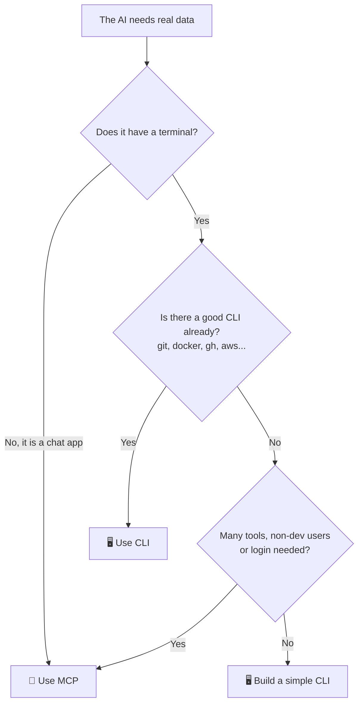

# 🍕 AI with CLI and MCP: why it gets more answers right

🇺🇸 English | 🇧🇷 [Português](README.pt-BR.md)

A simple experiment to show one idea:

> **An AI without access to data makes things up. With a CLI or an MCP to check, it gets it right.**

Here, the AI works at **Nona Byte Pizza**, a fake pizza shop.
It has no way to "know" the menu.
So we ask the same questions in 3 scenarios:

- **No tools:** the AI only has its own memory.
- **With CLI:** the AI runs the `pizza` command in a terminal.
- **With MCP:** the AI gets ready-made "buttons" from an MCP server.

Then we compare correct answers and cost.

---

## 🧠 CLI or MCP? Think of a pizza shop


**CLI = ordering at the counter.**
You say it directly: "one large Margherita".
It is fast and cheap. But you need to be there and know how to order.

**MCP = a delivery app.**
It has buttons, login and payment. Anyone can use it, from anywhere.
But the app loads the full menu every time it opens.

For the AI, this "menu" is the tool descriptions.
They are sent with **every** question, and they cost tokens.

---

## 🧭 Which one should I use?



| Situation | Best choice |
|---|---|
| Coding agent in your project | 🖥️ CLI |
| Tool that already has a CLI (git, docker, gh, aws) | 🖥️ CLI |
| You want to spend few tokens | 🖥️ CLI |
| Chat app, no terminal | 🔌 MCP |
| Many tools or APIs | 🔌 MCP |
| Team with people who don't code | 🔌 MCP |
| You need login, permissions and audit logs | 🔌 MCP |

**It's not a war.** Many projects use both.

---

## 📁 Project structure

| File | What it does |
|---|---|
| `pizza.py` | The CLI. Reads the menu and answers commands. |
| `mcp_server.py` | The MCP server. Same data, delivered as tools. |
| `data.json` | The menu (our "database"). |
| `questions.json` | The test questions and the right answers. |
| `experiment.py` | Asks the questions in the 3 modes and shows the score. |
| `docs/cli-vs-mcp.svg` | The infographic above. |

---

## 🚀 Step by step

### 1. Clone and install

```bash
git clone https://github.com/DenisHBernardino/ai-with-cli.git
cd ai-with-cli
python -m venv .venv
source .venv/bin/activate        # Windows: .venv\Scripts\activate
pip install -r requirements.txt
```

You need Python 3.10 or newer.

### 2. Play with the CLI yourself

Before the AI, try it yourself. This is what the AI will use.

```bash
python pizza.py --help
python pizza.py menu
python pizza.py menu --vegetarian
python pizza.py search mushroom
python pizza.py price four cheese --size L
python pizza.py price pepperoni --json
```

### 3. Add your API key

Get a key at [console.anthropic.com](https://console.anthropic.com).

```bash
export ANTHROPIC_API_KEY="your-key"          # Mac/Linux
$env:ANTHROPIC_API_KEY="your-key"            # Windows (PowerShell)
```

### 4. Run the experiment

```bash
python experiment.py
```

The MCP server starts by itself. You will see the AI at work:

```
❓ 1. How much is a large Margherita?
  ❌ [no tools] I don't have access to the current menu...
     🔧 AI ran: pizza --help
     🔧 AI ran: pizza price margherita --size L
  ✅ [with CLI] A large Margherita costs $52.00.
     🔌 AI called: get_price({"pizza": "Margherita", "size": "L"})
  ✅ [with MCP] A large Margherita costs $52.00.
```

*(Example only. AI answers change on each run.)*

At the end, you get the score. Paste yours here. 👇

| Mode | Correct | Total tokens | Tool calls | Fixed cost per call |
|---|---|---|---|---|
| no tools | ? / 6 | ? | 0 | 0 tokens |
| with CLI | ? / 6 | ? | ? | ? tokens |
| with MCP | ? / 6 | ? | ? | ? tokens |

**Fixed cost** = tokens the tool descriptions add to **every** call.

---

## 🔍 What to look for in the results

**1. With no tools, the AI gets it wrong.**
The menu is fake. It can only guess or say "I don't know".

**2. CLI and MCP should score about the same.**
Both give access to the same data.

**3. Here, the cost is close to a tie.**
There are only 3 MCP tools, so the "menu" is small.
The CLI may use one extra call to run `--help`.
With 30 or more tools, MCP would cost a lot more.

---

## ✨ What makes a tool good for AI

This works for both CLI and MCP:

| Detail | In the CLI | In the MCP |
|---|---|---|
| Explains how to use it | `--help` with examples | Clear description for each tool |
| Output easy to read | `--json` | Returns JSON |
| Error with a hint | `Hint: run 'menu'` | `Hint: use list_menu` |
| Can't break anything | Read-only + allowed commands | Read-only |

---

## ⚖️ Honest notes

- **With tools, the AI spends more tokens than without.** It checks data and reads output. The gain is **accuracy**.
- **CLI does not always win.** With many tools, some studies show MCP with a higher success rate.
- **A bad tool gets in the way.** Without a good description and clear errors, the AI gets lost, with CLI or MCP.

Further reading:
- [MCP vs CLI: a real AWS benchmark (dev.to)](https://dev.to/webramos/mcp-vs-cli-for-ai-agents-a-real-aws-benchmark-and-why-the-popular-narrative-asks-the-wrong-4h8)
- [MCP vs CLI: which one to use in 2026 (Firecrawl)](https://www.firecrawl.dev/blog/mcp-vs-cli)
- [MCP vs CLI: which is better for agentic AI (Nordic APIs)](https://nordicapis.com/mcp-vs-cli-which-is-better-for-agentic-ai/)
- [MCP vs CLI for AI agents: enterprise guide (Tyk)](https://tyk.io/learning-center/mcp-vs-cli-for-ai-agents-enterprise-comparison-guide/)

---

## 🎯 Challenges for you

1. Remove the examples from `--help`. Does the CLI AI make more mistakes?
2. Delete the MCP tool descriptions. What changes?
3. Create 20 fake MCP tools. Watch the "fixed cost" go up.
4. Add a `pizza combo` command and a `combo` tool with a discount.
5. Set Pepperoni `available` to `true` and run it again.

---

## 📄 License

MIT. Use it, copy it, teach it. 🍕
