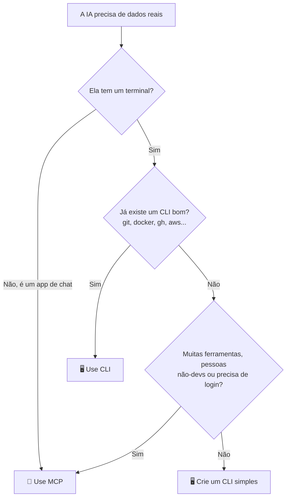

# 🍕 IA com CLI e MCP: por que ela acerta mais

🇺🇸 [English](README.md) | 🇧🇷 Português

[](https://github.com/DenisHBernardino/ai-with-cli/actions/workflows/tests.yml)

Um experimento simples para mostrar uma ideia:

> **Uma IA sem acesso aos dados inventa. Com um CLI ou um MCP para consultar, ela acerta.**

Aqui, a IA atende a **Nona Byte Pizza**, uma pizzaria fictícia.
Ela não tem como "saber" o cardápio.
Então fazemos as mesmas perguntas em 3 cenários:

- **Sem ferramenta:** a IA só tem a própria memória.
- **Com CLI:** a IA roda o comando `pizza` no terminal.
- **Com MCP:** a IA recebe "botões" prontos de um servidor MCP.

E comparamos acertos e custo.

<!-- Depois de gravar, coloque o GIF aqui:  -->

**Jeito mais rápido de ver:** rode `python app.py` e abra **a Arena** no navegador. 🏟️

> ℹ️ O código, os comandos e as perguntas estão em inglês. A explicação está em português.

---

## 🧠 CLI ou MCP? Pensa numa pizzaria


**CLI é pedir no balcão.**
Você fala direto: "uma Margherita grande".
É rápido e barato. Mas você precisa estar lá e saber pedir.

**MCP é o app de delivery.**
Tem botões, login e pagamento. Qualquer um usa, de qualquer lugar.
Mas o app carrega o cardápio inteiro toda vez que abre.

Na IA, esse "cardápio" são as descrições das ferramentas.
Elas vão junto em **toda** pergunta e custam tokens.

---

## 🧭 Qual eu uso?



| Situação | Melhor escolha |
|---|---|
| Agente de código no seu projeto | 🖥️ CLI |
| Ferramenta que já tem CLI (git, docker, gh, aws) | 🖥️ CLI |
| Quer gastar poucos tokens | 🖥️ CLI |
| App de chat, sem terminal | 🔌 MCP |
| Muitas ferramentas ou APIs | 🔌 MCP |
| Time com pessoas que não programam | 🔌 MCP |
| Precisa de login, permissões e auditoria | 🔌 MCP |

**Não é guerra.** Muitos projetos usam os dois.

---

## 📁 Estrutura

| Arquivo | O que faz |
|---|---|
| `pizza.py` | O CLI. Lê o cardápio e responde comandos. |
| `mcp_server.py` | O servidor MCP. Mesmos dados, entregues como ferramentas. |
| `core.py` | Lógica compartilhada: fala com a IA, roda ferramentas, conta tokens. |
| `app.py` + `web/index.html` | 🏟️ A Arena: a página web. |
| `experiment.py` | A versão no terminal: todas as perguntas, várias rodadas, tabela de placar. |
| `data.json` | O cardápio (a "base de dados"). |
| `questions.json` | As perguntas do teste e as respostas certas. |
| `runs/demo.json` | Uma execução real gravada, para o modo replay (você cria). |
| `tests/` | Testes automáticos (rodam no GitHub Actions). |
| `docs/cli-vs-mcp.svg` | O infográfico acima. |

---

## 🚀 Passo a passo

### 1. Clone e instale

```bash
git clone https://github.com/DenisHBernardino/ai-with-cli.git
cd ai-with-cli
python -m venv .venv
source .venv/bin/activate        # Windows: .venv\Scripts\activate
pip install -r requirements.txt
```

Precisa de Python 3.10 ou mais novo.

### 2. Brinque com o CLI você mesmo

Antes da IA, teste você. É isso que ela vai usar.

```bash
python pizza.py --help
python pizza.py menu
python pizza.py menu --vegetarian
python pizza.py search mushroom
python pizza.py price four cheese --size L
python pizza.py price pepperoni --json
```

### 3. Coloque sua chave da API

Pegue uma chave em [console.anthropic.com](https://console.anthropic.com) (Settings > API keys).

Copie o arquivo de exemplo e cole sua chave nele:

```bash
cp .env.example .env          # Windows: copy .env.example .env
```

```
ANTHROPIC_API_KEY=sk-ant-sua-chave-aqui
```

O `.env` está no `.gitignore`, então **nunca** vai para o GitHub.
Sem chave? Pule este passo: os testes e o CLI funcionam sem ela.

### 4. Abra a Arena 🏟️

```bash
python app.py
```

O navegador abre em `http://localhost:8000`.

- Clique numa pergunta. As 3 IAs respondem lado a lado.
- Olhe a coluna do CLI: a IA roda `pizza --help` **sozinha** para aprender a ferramenta.
- Olhe a coluna "No tools": ela responde com confiança, mas sem dados.
- Arraste o controle do **custo escondido** de 3 até 50 ferramentas MCP. A barra de tokens cresce. São contagens reais da API.

### 5. Sem chave da API? Use o modo replay

Alguém com chave grava uma execução real:

```bash
python app.py --record      # salva runs/demo.json
```

Faça commit do `runs/demo.json`. Agora qualquer um roda `python app.py` **sem chave**.
A página mostra o selo "Replay of a real run", para ninguém achar que é ao vivo.

### 6. Rode o experimento completo no terminal

```bash
python experiment.py              # cada pergunta 3 vezes
python experiment.py --runs 1     # mais rápido e barato
```

A IA varia de uma rodada para outra, então o placar é uma média.

```
❓ 1. How much is a large Margherita?
     🔧 AI ran: pizza --help
     🔧 AI ran: pizza price margherita --size L
  ❌❌❌ [no tools] I don't have access to the current menu...
  ✅✅✅ [with CLI] A large Margherita costs $52.00.
     🔌 AI called: get_price({"pizza": "Margherita", "size": "L"})
  ✅✅✅ [with MCP] A large Margherita costs $52.00.
```

*(Exemplo ilustrativo. Seus resultados vão ser diferentes.)*

No fim, sai o placar. Cole o seu aqui. 👇

| Modo | Acertos | Tokens por rodada | Chamadas por rodada | Custo fixo por chamada |
|---|---|---|---|---|
| no tools | ? / 6 | ? | 0 | 0 tokens |
| with CLI | ? / 6 | ? | ? | ? tokens |
| with MCP | ? / 6 | ? | ? | ? tokens |

**Custo fixo** = tokens que as descrições das ferramentas somam em **toda** chamada.

### 7. Rode os testes

```bash
python -m unittest discover -s tests -t . -v
```

Não precisa de chave. O GitHub Actions roda a cada push.

---

## 🔍 O que observar no resultado

**1. Sem ferramenta, a IA erra.**
O cardápio é inventado. Ela só pode chutar ou dizer "não sei".

**2. CLI e MCP devem acertar parecido.**
Os dois dão acesso aos mesmos dados.

**3. Aqui, o custo fica perto do empate.**
São só 3 ferramentas MCP, então o "cardápio" é pequeno.
O CLI pode gastar uma chamada a mais rodando `--help`.
Com 30 ou mais ferramentas, o MCP pesaria bem mais.

---

## ✨ O que torna uma ferramenta boa para IA

Vale para CLI e para MCP:

| Detalhe | No CLI | No MCP |
|---|---|---|
| Explica como usar | `--help` com exemplos | Descrição clara em cada ferramenta |
| Saída fácil de ler | `--json` | Retorna JSON |
| Erro com dica | `Hint: run 'menu'` | `Hint: use list_menu` |
| Não estraga nada | Só leitura + comandos permitidos | Só leitura |

---

## ⚖️ Ressalvas honestas

- **Com ferramenta, a IA gasta mais tokens que sem.** Ela consulta e lê saídas. O ganho é **acerto**.
- **CLI não vence sempre.** Com muitas ferramentas, há estudos em que o MCP teve mais sucesso.
- **Ferramenta ruim atrapalha.** Sem boa descrição e erros claros, a IA se perde, seja CLI ou MCP.

Leituras (em inglês):
- [MCP vs CLI: benchmark real na AWS (dev.to)](https://dev.to/webramos/mcp-vs-cli-for-ai-agents-a-real-aws-benchmark-and-why-the-popular-narrative-asks-the-wrong-4h8)
- [MCP vs CLI: qual usar em 2026 (Firecrawl)](https://www.firecrawl.dev/blog/mcp-vs-cli)
- [MCP vs CLI: qual é melhor para IA agêntica (Nordic APIs)](https://nordicapis.com/mcp-vs-cli-which-is-better-for-agentic-ai/)
- [MCP vs CLI para agentes: guia corporativo (Tyk)](https://tyk.io/learning-center/mcp-vs-cli-for-ai-agents-enterprise-comparison-guide/)

---

## 🎯 Desafios para você

1. Remova os exemplos do `--help`. A IA com CLI erra mais?
2. Apague as descrições das ferramentas MCP. O que muda?
3. Abra o `core.py` e mude as descrições das ferramentas falsas. O controle deslizante muda?
4. Crie o comando `pizza combo` e a ferramenta `combo` com desconto.
5. Mude `available` da Pepperoni para `true` e rode de novo.

---

## 🎥 Grave um GIF para o README ou o LinkedIn

1. Rode `python app.py` e clique numa pergunta.
2. Grave a tela por uns 15 segundos:
   - Windows: [ScreenToGif](https://www.screentogif.com/)
   - Mac: [Kap](https://getkap.co/)
   - Linux: [Peek](https://github.com/phw/peek)
3. Salve como `docs/arena.gif` e descomente a linha do GIF no topo deste README.

---

## 📄 Licença

MIT. Use, copie e ensine. 🍕
