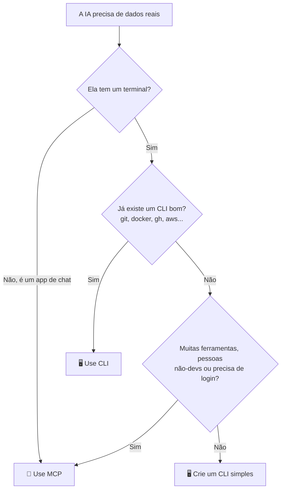

# 🍕 IA com CLI e MCP: por que ela acerta mais

🇺🇸 [English](README.md) | 🇧🇷 Português

[](https://github.com/DenisHBernardino/ai-with-cli/actions/workflows/tests.yml)

Um experimento simples para mostrar uma ideia:

> **Uma IA sem acesso aos dados inventa. Com um CLI ou um MCP para consultar, ela acerta.**

Aqui, a IA atende a **Nona Byte Pizza**, uma pizzaria fictícia.
Ela não tem como "saber" o cardápio.
Então fazemos as mesmas perguntas em 3 cenários:

- **Sem ferramenta:** a IA só tem a própria memória.
- **Com CLI:** a IA roda o comando `pizza` no terminal.
- **Com MCP:** a IA recebe "botões" prontos de um servidor MCP.

E comparamos acertos e custo.


**Jeito mais rápido de ver:** rode `python app.py` e abra **a Arena** no navegador. 🏟️

> ℹ️ O código, os comandos e as perguntas estão em inglês. A explicação está em português.

---

## 🧠 CLI ou MCP? Pensa numa pizzaria


**CLI é pedir no balcão.**
Você fala direto: "uma Margherita grande".
É rápido e barato. Mas você precisa estar lá e saber pedir.

**MCP é o app de delivery.**
Tem botões, login e pagamento. Qualquer um usa, de qualquer lugar.
Mas o app carrega o cardápio inteiro toda vez que abre.

Na IA, esse "cardápio" são as descrições das ferramentas.
Elas vão junto em **toda** pergunta e custam tokens.

---

## 🧭 Qual eu uso?



| Situação | Melhor escolha |
|---|---|
| Agente de código no seu projeto | 🖥️ CLI |
| Ferramenta que já tem CLI (git, docker, gh, aws) | 🖥️ CLI |
| Quer gastar poucos tokens | 🖥️ CLI |
| App de chat, sem terminal | 🔌 MCP |
| Muitas ferramentas ou APIs | 🔌 MCP |
| Time com pessoas que não programam | 🔌 MCP |
| Precisa de login, permissões e auditoria | 🔌 MCP |

**Não é guerra.** Muitos projetos usam os dois.

---

## 📁 Estrutura

| Arquivo | O que faz |
|---|---|
| `pizza.py` | O CLI. Lê o cardápio e responde comandos. |
| `mcp_server.py` | O servidor MCP. Mesmos dados, entregues como ferramentas. |
| `core.py` | Lógica compartilhada: fala com a IA, roda ferramentas, conta tokens. |
| `app.py` + `web/index.html` | 🏟️ A Arena: a página web. |
| `experiment.py` | A versão no terminal: todas as perguntas, várias rodadas, tabela de placar. |
| `format_lab.py` + `formats.py` | 📦 O laboratório de formato: os mesmos dados em 3 formatos. |
| `.env.example` | Modelo do arquivo `.env` com a chave da API. |
| `data.json` | O cardápio (a "base de dados"). |
| `questions.json` | As perguntas do teste e as respostas certas. |
| `runs/demo.json` | Uma execução real gravada, para o modo replay (você cria). |
| `tests/` | Testes automáticos (rodam no GitHub Actions). |
| `docs/cli-vs-mcp.svg` | O infográfico acima. |

---

## 🚀 Passo a passo

### 1. Clone e instale

```bash
git clone https://github.com/DenisHBernardino/ai-with-cli.git
cd ai-with-cli
python -m venv .venv
source .venv/bin/activate        # Windows: .venv\Scripts\activate
pip install -r requirements.txt
```

Precisa de Python 3.10 ou mais novo.

### 2. Brinque com o CLI você mesmo

Antes da IA, teste você. É isso que ela vai usar.

```bash
python pizza.py --help
python pizza.py menu
python pizza.py menu --vegetarian
python pizza.py search mushroom
python pizza.py price four cheese --size L
python pizza.py price pepperoni --json
```

### 3. Coloque sua chave da API

Pegue uma chave em [console.anthropic.com](https://console.anthropic.com) (Settings > API keys).

Copie o arquivo de exemplo e cole sua chave nele:

```bash
cp .env.example .env          # Windows: copy .env.example .env
```

```
ANTHROPIC_API_KEY=sk-ant-sua-chave-aqui
```

O `.env` está no `.gitignore`, então **nunca** vai para o GitHub.
Sem chave? Pule este passo: os testes e o CLI funcionam sem ela.

### 4. Abra a Arena 🏟️

```bash
python app.py
```

O navegador abre em `http://localhost:8000`.

- Clique numa pergunta. As 3 IAs respondem lado a lado.
- Olhe a coluna do CLI: a IA roda `pizza --help` **sozinha** para aprender a ferramenta.
- Olhe a coluna "No tools": ela responde com confiança, mas sem dados.
- Arraste o controle do **custo escondido** de 3 até 50 ferramentas MCP. A barra de tokens cresce. São contagens reais da API.

### 5. Sem chave da API? Use o modo replay

Alguém com chave grava uma execução real:

```bash
python app.py --record      # salva runs/demo.json
```

Faça commit do `runs/demo.json`. Agora qualquer um roda `python app.py` **sem chave**.
A página mostra o selo "Replay of a real run", para ninguém achar que é ao vivo.

### 6. Rode o experimento completo no terminal

```bash
python experiment.py              # cada pergunta 3 vezes
python experiment.py --runs 1     # mais rápido e barato
```

A IA varia de uma rodada para outra, então o placar é uma média.

```
❓ 1. How much is a large Margherita?
     🔧 AI ran: pizza --help
     🔧 AI ran: pizza price margherita --size L
  ❌❌❌ [no tools] I don't have access to the current menu...
  ✅✅✅ [with CLI] A large Margherita costs $52.00.
     🔌 AI called: get_price({"pizza": "Margherita", "size": "L"})
  ✅✅✅ [with MCP] A large Margherita costs $52.00.
```

*(Exemplo ilustrativo. Seus resultados vão ser diferentes.)*

No fim, sai o placar. Cole o seu aqui. 👇

| Modo | Acertos | Tokens por rodada | Chamadas por rodada | Custo fixo por chamada |
|---|---|---|---|---|
| no tools | ? / 6 | ? | 0 | 0 tokens |
| with CLI | ? / 6 | ? | ? | ? tokens |
| with MCP | ? / 6 | ? | ? | ? tokens |

**Custo fixo** = tokens que as descrições das ferramentas somam em **toda** chamada.

### 7. Rode os testes

```bash
python -m unittest discover -s tests -t . -v
```

Não precisa de chave. O GitHub Actions roda a cada push.

---

## 🔍 O que observar no resultado

**1. Sem ferramenta, a IA não tem como acertar.**
O cardápio é inventado. A IA chuta ou diz "não sei". Um bom modelo costuma recusar o chute, o que é honesto, mas ainda não ajuda.

**2. CLI e MCP aprendem a ferramenta de jeitos diferentes.**
A IA com CLI muitas vezes lê o `--help` primeiro, como um dev lendo a documentação.
A IA com MCP pula essa etapa, porque as ferramentas MCP já chegam descritas. Ela vai direto chamar.

**3. O tamanho da saída define o custo.**
Nos nossos testes, o MCP gastou mais tokens que o CLI, mesmo com só 3 ferramentas.
O motivo: o CLI responde com texto curto, e as ferramentas MCP respondem com JSON completo.

Exemplo de uma execução real (`claude-sonnet-5-5`):

| Pergunta | CLI | MCP |
|---|---|---|
| "How much is a medium Ham & Egg plus a large Four Cheese?" | 1.352 tokens, 2 chamadas | 2.063 tokens, 2 chamadas |
| "Explore the tool, then tell me 3 ways you can help." | 3.444 tokens, 5 chamadas | 4.847 tokens, 4 chamadas |

Na segunda pergunta, a IA com CLI rodou `pizza --help`, depois o `--help` de cada comando e depois `pizza menu`.
A IA com MCP chamou `list_menu` 3 vezes e recebeu 112, 64 e 97 linhas de JSON.

*A IA varia a cada execução. Rode a sua e compare.*

**4. Mais ferramentas = custo escondido maior.**
Arraste o controle da Arena de 3 até 50 ferramentas. O MCP envia a descrição de todas em toda pergunta.

---

## 💬 Perguntas para testar

Digite na Arena (em inglês, como o projeto). Elas exigem várias etapas, então você vê a IA explorar a ferramenta de verdade.

| Pergunta | O que mostra | Resposta esperada |
|---|---|---|
| Before answering, explore what the pizza tool can do. Then tell me 3 ways you can help me. | Como cada IA aprende a ferramenta | Resposta livre |
| I want a Pepperoni. If I can't have it, what's the closest pizza available today? | Descobre que a Pepperoni acabou e compara ingredientes | Ham & Egg |
| I'm vegetarian and I have $40. What medium pizza can I order today? | Filtro + preço + disponibilidade | Banana Cinnamon ($38) |
| I'm allergic to onion. Which pizzas can I eat, and which is the cheapest large one? | Exclui ingredientes | Banana Cinnamon ($48) |
| Which ingredient appears in the most pizzas? | Lê o cardápio inteiro e conta | Mozzarella (6 de 7) |
| Plan a party: 2 large pizzas, one vegetarian and one with meat, only available ones, cheapest total. | Planejamento | Banana Cinnamon + Chicken & Cream Cheese = $102 |

---

## 📦 O laboratório de formato de saída

Nas primeiras execuções, o MCP gastou mais tokens que o CLI. Os registros indicavam um motivo: o CLI responde com texto curto, e as ferramentas MCP respondiam com JSON formatado. Mas os totais misturavam várias coisas: o tamanho da saída das ferramentas, o tamanho da resposta da IA e o número de chamadas.

Por isso, o laboratório separa tudo.

**Parte 1: teste isolado.** As mesmas 5 chamadas, o mesmo servidor MCP, os mesmos dados. Só o formato da saída muda. Nenhuma resposta da IA é gerada: só contamos os tokens com a API. **O formato é a única variável.**

| Formato | O que a IA recebe |
|---|---|
| Pretty JSON | JSON com quebras de linha e recuos |
| Compact JSON | O mesmo JSON, sem espaços |
| Plain text | Texto curto, exatamente o que o CLI mostra |

**Parte 2: teste de ponta a ponta.** As 6 perguntas do teste respondidas pela IA, com o MCP em cada formato, mais o CLI. Os tokens são separados em três números:

- **Saída das ferramentas:** só o que as ferramentas devolveram, contado uma vez cada.
- **A IA leu:** tudo o que a IA leu (pergunta, descrições das ferramentas, saídas e histórico).
- **A IA escreveu:** tudo o que a IA escreveu (a resposta e as chamadas de ferramenta).

Os resultados aparecem **por modelo**, nunca em média entre modelos.

```bash
python format_lab.py                          # só a parte 1 (só contagem de tokens)
python format_lab.py --e2e --runs 3           # parte 1 + parte 2
python format_lab.py --e2e --models claude-sonnet-5-5 claude-haiku-4-5
python format_lab.py --e2e --save             # também salva runs/format_lab.json
```

Na Arena também dá para ver:

- O seletor **"MCP tools answer in"** muda o formato da coluna do MCP.
- Cada coluna mostra **📦 tokens of tool output**, separado do total.
- A seção **output format lab** mostra a parte 1 com barras.

### Nossos resultados

Modelo `claude-sonnet-5-5`, 6 perguntas, 3 rodadas por pergunta, em cada setup.

**Parte 1: isolado (o formato é a única variável)**

| Formato | Tokens da saída (5 chamadas) | vs JSON formatado |
|---|---|---|
| Pretty JSON | 2.281 | 0% |
| Compact JSON | 1.479 | -35% |
| Plain text | 1.101 | -52% |

**Parte 2: ponta a ponta (média por rodada das 6 perguntas)**

| Setup | Acertos | Chamadas | Saída das ferramentas | A IA leu | A IA escreveu | Total |
|---|---|---|---|---|---|---|
| CLI* | 6,0/6 | 7,7 | 4.541 | 11.630 | 825 | 12.455 (-13%) |
| MCP, Pretty JSON | 6,0/6 | 8,0 | 3.231 | 13.384 | 939 | 14.323 (0%) |
| MCP, Compact JSON | 6,0/6 | 8,0 | 2.099 | 12.252 | 881 | 13.133 (-8%) |
| MCP, Plain text | 6,0/6 | 8,0 | 1.544 | 11.696 | 894 | 12.589 (-12%) |

**O que aprendemos**

1. **O formato sozinho pesa muito.** Os mesmos dados: 35% menos tokens em JSON compacto, 52% menos em texto simples.
2. **Formatos curtos não pioraram a precisão.** Todos os setups acertaram 18 de 18.
3. **De ponta a ponta, o ganho é menor (8% a 12%).** A saída das ferramentas é só cerca de um quarto do que a IA lê. O resto são as instruções, as descrições das ferramentas e o histórico, que é reenviado a cada rodada.
4. **Com texto simples, o MCP quase empata com o CLI** (12.589 contra 12.455 tokens).
5. **A IA copia os exemplos da descrição da ferramenta.** O CLI devolveu mais saída (4.541 contra 1.544). Os registros mostraram o motivo: a descrição da ferramenta do CLI tinha `menu --json` como exemplo, e a IA rodou `pizza menu --json` na maioria das perguntas, recebendo JSON formatado. Ela leu o `--help` só uma vez. Tiramos o `--json` do exemplo.
6. **O formato muda a resposta, não só o custo.** Com JSON, a IA respondeu "52", porque o JSON não tem moeda. Com texto, respondeu "$52.00". A IA repete o que vê.
7. **Nosso primeiro número estava alto demais.** Uma pergunta e uma rodada mostraram o MCP custando cerca de 40% a mais. Com 6 perguntas e 3 rodadas, a diferença com JSON formatado é de 13%.

\* *Esta execução usou a descrição antiga do CLI, com `menu --json` como exemplo. Rode `python format_lab.py --e2e` de novo para ver o CLI com texto simples.*

*Limites: um modelo, um cardápio pequeno e perguntas fáceis. Teste outros modelos com `--models`.*

**O que ele não mede:** se um formato faz a IA entender os dados melhor ou pior em tarefas mais difíceis. Por isso, a parte 2 também mostra os acertos.

---

## ✨ O que torna uma ferramenta boa para IA

Vale para CLI e para MCP:

| Detalhe | No CLI | No MCP |
|---|---|---|
| Explica como usar | `--help` com exemplos | Descrição clara em cada ferramenta |
| Saída fácil de ler | Texto curto (`--json` quando precisar) | Texto curto ou JSON compacto |
| Erro com dica | `Hint: run 'menu'` | `Hint: use list_menu` |
| Não estraga nada | Só leitura + comandos permitidos | Só leitura |

---

## ⚖️ Ressalvas honestas

- **Com ferramenta, a IA gasta mais tokens que sem.** Ela consulta e lê saídas. O ganho é **acerto**.
- **CLI não vence sempre.** Com muitas ferramentas, há estudos em que o MCP teve mais sucesso.
- **Ferramenta ruim atrapalha.** Sem boa descrição e erros claros, a IA se perde, seja CLI ou MCP.

Leituras (em inglês):
- [MCP vs CLI: benchmark real na AWS (dev.to)](https://dev.to/webramos/mcp-vs-cli-for-ai-agents-a-real-aws-benchmark-and-why-the-popular-narrative-asks-the-wrong-4h8)
- [MCP vs CLI: qual usar em 2026 (Firecrawl)](https://www.firecrawl.dev/blog/mcp-vs-cli)
- [MCP vs CLI: qual é melhor para IA agêntica (Nordic APIs)](https://nordicapis.com/mcp-vs-cli-which-is-better-for-agentic-ai/)
- [MCP vs CLI para agentes: guia corporativo (Tyk)](https://tyk.io/learning-center/mcp-vs-cli-for-ai-agents-enterprise-comparison-guide/)

---

## 🎯 Desafios para você

1. Remova os exemplos do `--help`. A IA com CLI erra mais?
2. Apague as descrições das ferramentas MCP. O que muda?
3. Crie um 4º formato no `formats.py` que devolva só os campos necessários. Ele ganha do texto simples?
4. Abra o `core.py` e mude as descrições das ferramentas falsas. O controle deslizante muda?
5. Crie o comando `pizza combo` e a ferramenta `combo` com desconto.
6. Mude `available` da Pepperoni para `true` e rode de novo.
 

## 📄 Licença

MIT. Use, copie e ensine. 🍕
